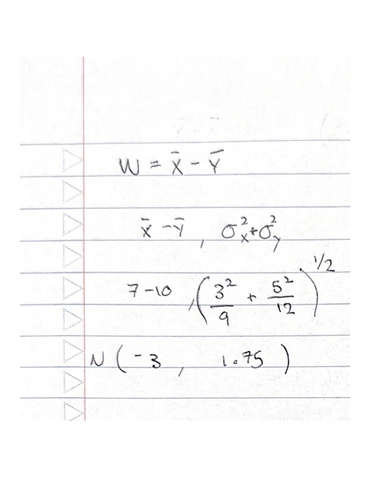
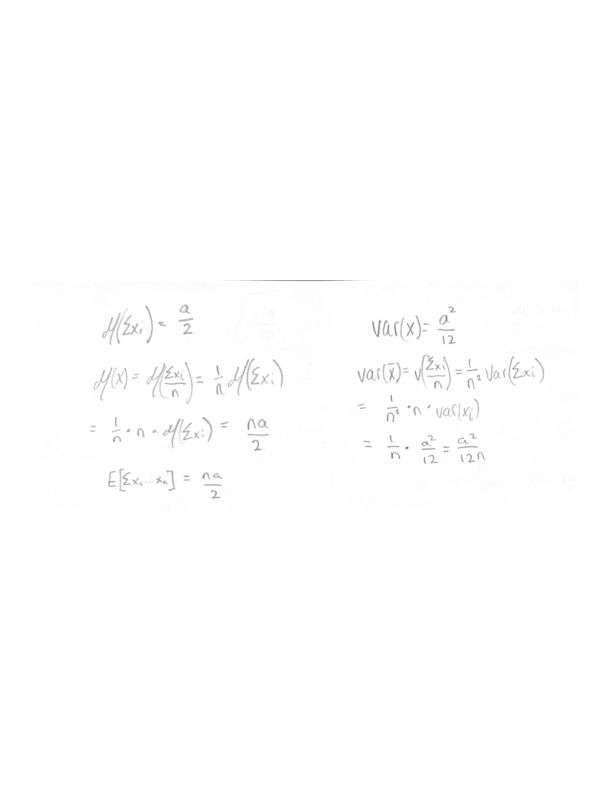

## Question 1: 16 points

Assume there are a total of 20 congressional seats up for election across the Unites States which has a multinomial distribution. We will assume that for every seat there are 3 candidates running, 1 from the Democratic party, 1 from the Republican party and 1 from an Independent party. We will also assume that for every seat there is a 45% chance the Democratic candidate will win, a 45% the Republican candidate will win and a 10% chance the Independent will win.

Let Democrat be denoted as $D$, Republican as $R$ and Independent as $I$

Use a simulation with `rmultinom` to show that $P(D = 9, R = 9, I = 2) \approx 0.0529$. Confirm your results using `dmultinom`.

```{r}
# set seed
set.seed(1)
# create simulations
sims <- rmultinom(10000,20,prob=c(.45,.45,.1))
# create the dataframe that we'll need to find the probabilities
df = data.frame(sims)
dft = t(df)
colnames(dft) <- c('D','R','I')
dft2 <- as.data.frame(dft)
# search for the events where event happened
sample.prob <- length(dft2[dft2$D==9 & dft2$R==9 & dft2$I==2,]$R)/10000
theory.prob <- dmultinom(c(9,9,2),20,c(.45,.45,.1))
# printing the 
print(paste0('The sample probability is: ', sample.prob))
print(paste0('The theoretical probability is: ', theory.prob))
```

## Question 2: 18 points

Suppose $X = (X_1,X_2,X_3)$ has a multinomial distribution with size $n = 10$ and probabilities $p_1 = .3, p_2 = .4, p_3 = .3$. Use a simulation with `sample` (not `rmultinom`) to show that $P(X_1 = 3, X_2 = 4, X_3 = 3) \approx 0.0784$. Confirm your results using **dmultinom**.

```{r}
set.seed(42)
dft <- t(as.data.frame(replicate(10000, table({b <- c(0, 1, 2); factor(sample(b, size=10, replace=TRUE, prob=c(.3, .4, .3)), levels=b)}))))
colnames(dft) <- c("X.1", "X.2", "X.3")
dft <- as.data.frame(dft)

sample.prob <- length(dft[dft$X.1==3 & dft$X.2==4 & dft$X.3==3,]$X.1)/length(dft$X.1)
theory.prob <- dmultinom(c(3,4,3),10,c(.3,.4,.3))
print(paste0('The sample probability is: ', sample.prob))
print(paste0('The theoretical probability is: ', theory.prob))
```

## Question 3: 14 points

Let $X_1, \dots, X_{12}$ be a random sample of size 12 from the $U(0,1)$ distribution. Explain why $Z = X_1 + X_2 + \dots + X_{12} - 6$ has an approximate standard normal distribution. You can either prove this theoretically by using CLT, or can use a simulation. \textit{You will have to find or look up the variance of a single $X_i$.}

```{r}
# create the samples for runif and put them in a df
r = 10000
c = 12
m <- matrix(ncol=c, nrow=r)
for(i in 1:r){
  m[i,] <- runif(12)
}
df <- data.frame(m)

# create the Z values for each sample
df$Z <- rowSums(df)-6
# plot the Z values to prove normalcy
hist(df$Z)
# normalcy test
ks.test(df$Z, "pnorm")
```

I simulated 10,000 values of Z and plotted the histogram. The plot shows that Z has an approximately normal distribution and the ks test also shows a p-value higher than 0.05, allowing us to reject the hypothesis of Z not being normal.

## Question 4: 20 points

Problem 4.4 #14 a (8) and b(12) in Chihara/Hesterberg.

{width="250"}


```{r}
# create the samples for the sum and put them in a dataframe
r = 10000
c = 1
m <- matrix(ncol=c, nrow=r)
for(i in 1:r){
  Z <- mean(rnorm(9,7,3))- mean(rnorm(12,10,5))
  m[i,] <- Z
}
df <- data.frame(m)

#plotting the histogram
hist(df$m)
# mean of the values
mean.theory = -3
var.theory = 37/12
sd.theory <- sqrt(var.theory)
print(paste0('The theoretical mean is: ', mean.theory))
print(paste0('The mean of the values is: ', mean(df$m)))
# sd of the values
print(paste0('The theoretical sd is: ', sd.theory))
print(paste0('The sd of the values is: ', sd(df$m)))
# finding the probability of W being less than or equal to -1.5 with my samples
print(paste0('The sample probability is: ',length(df[df$m <= -1.5,])/length(df$m)))
# finding the theoretical exact answer
prob.theory = pnorm(-1.5,mean = mean.theory, sd = sqrt(var.theory))
print(paste0('The theoretical probability is: ', prob.theory))
```

As we can see, both the mean and the standard deviation of the sample are almost identical to their equivalent, theoretical values.

## Question 5 : 32 points, 8 for each

Problem 4.4 #18 in Chihara/Hesterberg.

A. Simulate the sampling distribution.

```{r}
# get the 30 numbers and their mean
x <- replicate(10000, mean(rexp(30,1/3)))
# plot the distribution
hist(x)
```

B.Find the mean and standard error of the sampling distribution and compare to theoretical results.

```{r}
# getting mean and sd
print(paste0('Sample mean: ', mean(x)))
print(paste0('Sample sd: ', sd(x)))

# theoretical values
print(paste0('Theoretical mean: ', (1/(1/3))))
print(paste0('Theoretical sd: ', 3/sqrt(30)))
```

We can see that the theoretical and sample statistics are almost the same, which is expected.

C. Find P(X.bar\<=3.5) from the simulation.

```{r}
length(x[x<=3.5])/length(x)
```

D. Estimate the same probability assuming the CLT approximation holds. Compare the result with the answer from part C.

```{r}
pnorm(3.5, mean=mean(x),sd=sd(x))
```

Comparison: The theoretical result gives us basically the same probability as the sample.

## Problem 6 (Bonus, 10 Points)

Let $X_1, \dots, X_n$ be a random sample of size $n$ from a $U(0,a)$ distribution, where $a > 0$. Find $E(X_1+X_2+ \dots + X_n)$. and find the approximate distribution of the sample mean, if $n$ is large.





