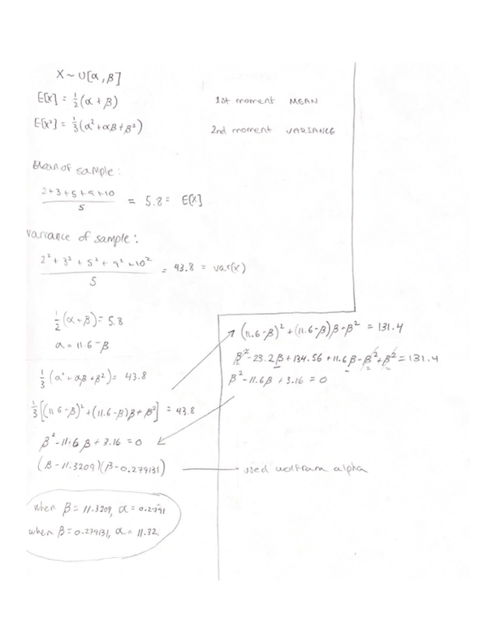

## Problem 1 (20 points, 5 for each)

Problem 5.10 \#12 in Chihara/Hesterberg. 

The data set FishMercury contains mercury levels (parts per million) for 30 fish caught in lakes in Minnesota.

```{r}
# import the dataset
fish <- read.csv('./FishMercury.csv')
mercury <- fish$Mercury
head(fish)
```

(a) Create a histogram or boxplot of the data. What do you observe?

```{r}
boxplot(fish$Mercury)
```

There is one very clear outlier that distorts the boxplot image. Keeping it in the data could give us incorrect testing results.

(b) Find the Bootstrap sampling mean and record the bootstrap standard error and the $95\%$ bootstrap percentile interval.

```{r}
set.seed(42)
# bootstrap
mercury.boot <- replicate(1000, mean(sample(mercury, length(fish$Mercury), replace=TRUE)))
# mean of the bootstrap
boot.mean <- mean(mercury.boot)
print(paste0('The bootstrap mean is: ', boot.mean))
# bootstrap standard error
boot.sd <- sd(mercury.boot)
print(paste0('The bootstrap standard error is: ', boot.sd))
# 95% bootstrap percentile interval
quantile(mercury.boot, c(0.025, 0.975))
```

(c) Remove the outlier and find bootstrap sampling mean of the remaining data. Record the bootstrap standard error and the $95\%$ bootstrap percentile interval. Comment on your results.

```{r}
set.seed(42)
# removing the outlier
newMercury <- fish[fish$Mercury != max(fish$Mercury),]
# bootstrap
newM.boot <- replicate(1000, mean(sample(newMercury, 29, replace=TRUE)))
# mean
newM.boot.mean <- mean(newM.boot)
newM.boot.mean
# stnadard error
newM.boot.sd <- sd(newM.boot)
newM.boot.sd
# quantile range
quantile(newM.boot, c(0.025,0.975))
```

(d) What effect did removing the outlier have on the bootstrap distribution, in particular, the standard error?

The effect of removing the outlier was very obvious. The bootstrap mean dropped by 33%, or from .0.18 to 0.12, while the standard deviation dropped by a factor of ~8, or from 0.058 to 0.007. Having the outlier in the dataset would likely cause a misrepresentation of the data, which is why we got such different metrics.


## Problem 2 (20 points, extra bonus 5 points inside the question )

Problem 3.9 \#12abc in Chihara/Hesterberg. 

Two students went to a local supermarket and collected data on cereals; they classified cereals by their target consumer (children versus adults) and the placement of the cereal on the shelf (bottom, middle, and top). The data are given in _Cereals_.

```{r}
c <- read.csv('./Cereals.csv')
head(c)
```

(a) (_2 points_) Create a table (Two-way) to summarize the relationship between age of target consumer and shelf location.

```{r}
tt <- table(c$Age, c$Shelf)
tt
```

(b) (_3 points_) Conduct a chi-square test using R’s chisq.test() command. Write your null and alternative hypothesis. What is your conclusion based on the results of your test?

Null: cereal placement among the shelves is independent from it being for adults or children.

Alternative: cereal placement is dependent on it being for adults or children.

```{r}
chisq.test(tt)
```

With a p-value smaller than 0.05, we have enough evidence to reject the null hypothesis stating that the cereals of adults and children are equally distributed among the three possible shelves.

(c) (_2 points_) R returns a warning message. Compute the expected counts for each cell to see why.

```{r}
chisq.test(tt)$expected
```

Since one of the expected values is less than 5, the sample is too small and chi squared might not be the best test to use.

(d) (_3 points_) Use a Yate's continuity correction and do the test again. What is your conclusion?

```{r}
chisq.test(tt, correct=TRUE)
```

Using Yate's correction gives me the same results as before. With a p-value smaller than 0.05, we have enough evidence to reject the null hypothesis.

(e) (_5 points_) (self-learn question) Use a Fisher's Exact Test. What is your conclusion?. (We use a Fisher's Exact Test when the sample sizes are small and the expected cell counts are less than 5 : Example to refer:<https://statsandr.com/blog/fisher-s-exact-test-in-r-independence-test-for-a-small-sample/>).  

```{r}
# performing the test
fisher.test(tt)
```

The conclusion is the same as the other tests. With a p-value smaller than 0.05, we have enough evidence to reject the null hypothesis of cerel distribution being independent from adult or child category.

(f) (_5 points_) Compare your results  of part (b),(d),(e). Explain/Compare in few sentences where/when/what situations should we use Yate's Continuity correction and Fisher's exact test.

The results for part b, d, and e yielded the same thing, which was enough evidence to reject the null hypothesis. 

When to use Yate's Continuity Correction: a common guideline for this test is to use it when there is a cell in the table with an expected count less than 10. Like Fisher's test, it tries to take care of the lack of samples problem.

When to use Fisher's exact test: this test should be used when at least one of the expected values in your table is less than 5. When the value is less than 5, it usually means that we don't have enough samples to make the appropriate inferences, so we need to keep that in mind.


## Problem 3 (15 points)


_Distribution A is a standard normal distribution and distribution B is a $N(1, 2^2)$ distribution. Generate 20 random numbers from distribution A and 30 random numbers form distribution B and  record these in a suitable data frame._

Examine the  null hypothesis that the means of A and B are the same against the alternative that the mean of B is larger, using a permutation test. Report the p-value and state your conclusion.
```{r}
set.seed(1)

# get the values from the distributions
A <- rnorm(20)
B <- rnorm(30,1,2)
AB <- c(A, B)
# create empty dataframe and add column names
df <- data.frame(matrix(ncol = 2, nrow = 50))
x <- c("Distribution", "Value")
colnames(df) <- x
# assign AB vector to the value column
df$Value <- AB
# add the labels to their respective values
df$Distribution[1:20] <- 'A'
df$Distribution[21:50] <- 'B'
# take a look at the dataframe
head(df)

# difference in means function
f.1 = function(df){
  agg <- aggregate(Value ~ Distribution, data = df, FUN = mean)
  # mean B - mean A
  return(agg$Value[2]-agg$Value[1])
}

# create a permutation df
df.permute <- df

# permutation test
permute <- function(){
  df.permute$Distribution = df.permute$Distribution[sample(length(df$Distribution),length(df$Distribution),replace=F)]
  return(f.1(df.permute))
}

# do it 1000 times
test.1 <- replicate(1000, permute())

# find p-value
mean(test.1>f.1(df))
```

With a p-value of 0.016, we have enough evidence to reject the null hypothesis that the means of the distributions are equal.

## Problem 4 (20 points)

This problem is similar to what we have done in the lab using the spotify data. Please use the "Artists.csv" data set.

Data Science Question: Is the average "liveness" larger for Beyoncé than that of Taylor Swift?

Liveness: This value describes the probability that the song was recorded with a live audience. According to the official documentation “a value above 0.8 provides strong likelihood that the track is live”.

```{r}
# load the dataset
art <- read.csv('./Artists.csv')
head(art)
```

a. Perform meaningful EDA (Exploratory Data Analysis) using some Data Visualizations (relevant to this data science question).

```{r}
library(ggplot2)
ggplot(data=art, aes(x=artist_name, y=liveness, fill=artist_name)) +
  geom_boxplot()
```

Although all artists have a mean closer to 0 than 1, the spread of the values is highest with Beyoncé, and they all have plenty of outliers. Then, sequentially, we have John Legend and Taylor Swift.

```{r}
hist(art$liveness)
```

Looking at the distribution of liveness, we can assume that most songs were not recorded with a live audience, which makes sense because recording is generally done in a studio.

b. Write the null and alternative hypothesis for this test.

Null: the average liveness for Taylor Swift and Beyoncé is equal.

Alternative: the average liveness for Beyonce is larger than TS's.

c. Perform a t-test and state your results and non-technical conclusion.

```{r}
TS.live <- subset(art, select=liveness, subset=artist_name=='Taylor Swift', drop=T)
B.live <- subset(art, select=liveness, subset=artist_name=='Beyoncé', drop=T)
t.test(B.live, TS.live, alt='greater')
```

With a p-value smaller than 0.05, we have enough evidence to reject the null hypothesis of Talyor Swift and Beyonce's liveness being equal. This leads us to believe that Beyoncés average liveness is in fact higher than taylor Swift's.

d. What can you say about the confidence interval? (Interpret)

We can be 95% confident that the difference of the liveness means between Beyoncé and Taylor Swift will fall between greater than 0.1.

e. Perform a bootstrap test for ratio of means of "liveness", Find the 95% bootstrap percentile interval for the ratio of means and write your conclusion.

```{r}
set.seed(42)
# bootstrap
boot.ts <- replicate(1000, mean(sample(TS.live, length(TS.live), replace=TRUE)))
boot.b <- replicate(1000, mean(sample(B.live, length(B.live), replace=TRUE)))
# divide the vector to get the ratios
boot.ratio <- boot.b/boot.ts
# get the 95% confidence interval
quantile(boot.ratio, c(0.025, 0.975))
```

We can say with 95% confidence that the ratio of means between Beyoncé and Taylor Swift will fall between 1.6 and 1.88. This means that Beyoncé has a higher mean liveness than Taylor Swift.

f. What is the bootstrap estimate of the bias for the mean ratio?

```{r}
mean.boot <- mean(boot.ratio)
real.bias <- mean(B.live)/mean(TS.live)
paste0('The bias for the mean ratio is:', mean.boot-real.bias)
```

g. Compare your results from part c) and part e).

Given that the mean liveness of Beyoncé and Swift are 0.28 and 0.16, respectively, we find the ratio of means to be around 1.75. With our calculations in part e, we can say with 95% confidence that the ratio between Beyoncé and Swift will be between 1.6 and 1.87, which is in line with our previous findings. The numbers indicate that there is a difference between the means.

## Problem 5 (15 points)

Write an R function that computes the t-formula confidence interval in (7.8) from sample mean, sample standard deviation, sample size, and confidence level, and use it to do exercise 7.6 #6 in Chihara/Hesterberg.

Q: Julie is interested in the sugar content of vanilla ice cream. She obtains a random sample of $n = 20$ brands and finds an average of $18.05 g$ with standard deviation $5 g$ (per half cup serving). Assuming that the data come from a normal distribution, find a $90\%$ confidence interval for the mean amount of sugar in a half cup serving of vanilla ice cream.

```{r}
# function. the interval has to be entered as a decimal
int <- function(mean,sd,n,interval){
  t <- qt(1-(1-interval)/2,n-1)
  l <- mean - t*(sd/sqrt(n))
  u <- mean + t*(sd/sqrt(n))
  return(c(l,u))
}
# finding the interval
print('A confidence interval of 90% for the mean amount of sugar in a half cup serving of vanilla ice cream is:')
int(18.05,5,20,.9)
```

## Problem 6 (15 points, 5 for each)

Exercise 7.6 #12 in Chihara/Hasterberg.

Q: Consider the data set _Girls2004_ (see Case Study in Section 1.2).

```{r}
girls <- read.csv('./Girls2004.csv')
head(girls)
```

(a) Create exploratory plots and compare the distribution of weights between babies born to nonsmokers and babies born to smokers.

```{r}
library(tidyverse)
library(ggplot2)

girls %>%
  ggplot(aes(x=Smoker, y=Weight, fill=Smoker)) +
  geom_boxplot() +
  ggtitle('Weight of babies born to smokers and non-smokers')
```

(b) Find a $95\%$ one-sided lower t confidence bound for the mean difference in weights between babies born to nonsmokers and smokers. Give a sentence interpreting the interval.

```{r}
# getting the subsets
W.NS <- subset(girls, select=Weight, subset=Smoker=='No', drop=T)
W.S <- subset(girls, select=Weight, subset=Smoker=='Yes', drop=T)

t.test(W.NS, W.S, alt='greater')
```

We can be 95% confident that the difference in the mean of the weights of babies coming from non-smokers and smokers will be greater than 15 units (units not given).

(c) What is your conclusion?

With a p-value smaller than 0.05, we have enough evidence to reject the null hypothesis of babies from smokers and non-smokers having the same average weight.

## BONUS: Submit _ONE_ of the Extra Problems:

### Ex. Problem 1 (10 Points)

Exercise 6.4 #1 in Chihara/Hesterberg.

Let X be a binomial random variable, $X \sim Binom(n, p)$. Show that the MLE of $p$ is $\hat{p}  = X/n$.


### Ex. Problem 2 (10 Points)

Exercise 6.4 #14 in Chihara/Hesterberg. 

Let the five numbers 2, 3, 5, 9, 10 come from the uniform distribution on $[\alpha, \beta]$. Find the method of moments estimates of $\alpha$ and $\beta$.



