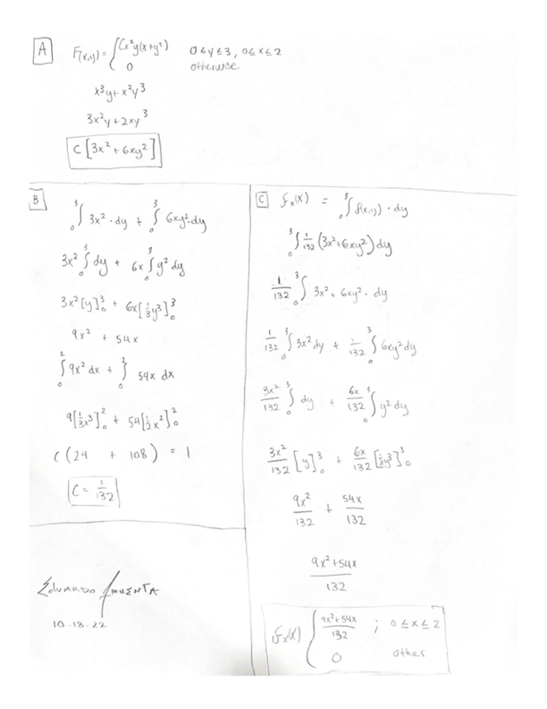
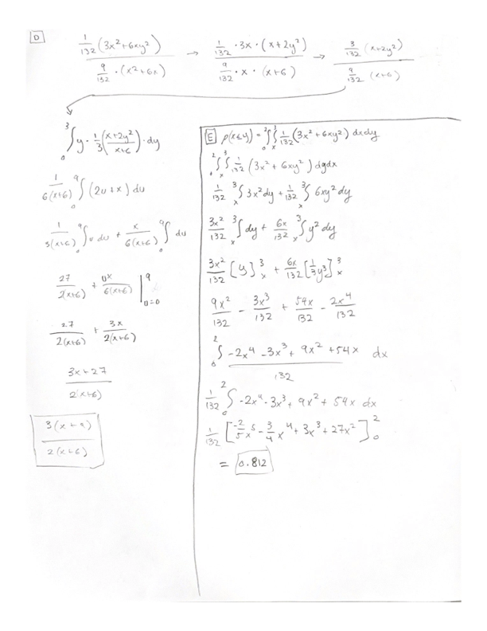

## Problem 1:

$X \sim U(0,1)$ and $Y \sim U(0,1)$.

Plot the joint distribution of X & Y such that $X+Y < 1$

a. First make a large number of samples from $X \sim U(0,1)$ and $Y \sim U(0,1)$ and plot X & Y and then plot the samples below the line  $x+y = 1$ .

```{r}
df <- data.frame(x = runif(10000), y = runif(10000))
plot(df, cex=.1)
df2 <- df[rowSums(df) < 1,]
plot(df2, cex=.1, main='Instances where X+Y<1')
```

b. By looking at the plot, what is the joint p.d.f $f(X,Y)$?
$$
\begin{aligned}
F(x,y) &= \begin{cases} x+y \quad (0<x,y<1, \quad x+y<1)\\
0 \quad \quad \quad otherwise
\end{cases}
\end{aligned}
$$

c. Find the marginal distribution of X by hand and making a probability histogram. Compare whether these are the same. (Hint: think about the limits of X and Y according to $0<X+Y<1$)
$$
\begin{aligned}
f_{X}(X) = \int_{0}^{1}f_{XY}(x, y)dx
\end{aligned}
$$
```{r}
hist(df2$x, prob=T)
```

d. Find the marginal distribution of Y by hand and making a probability histogram. Compare whether these are the same. (Hint: think about the limits of X and Y according to $0<X+Y<1$)

$$
\begin{aligned}
f_{Y}(y) = \int_{0}^1f_{XY}(x,y)dy
\end{aligned}
$$

```{r}
hist(df2$y, prob=T)
```

## Problem 2: Joint distributions and Conditional Expectations. 

A CDF is defined by 

$$
\begin{aligned}
F(x,y) &= \begin{cases} Cx^2y(x+y^2) \quad (0 \leq y \leq 3, 0 \leq x \leq 2)\\
0 \quad (otherwise) 
\end{cases}
\end{aligned}
$$


a. Find the joint probability density function.


b. Find the value of $C$.


c. Find the Marginal density of $X$


d. Find the Conditional expectation $E(Y|X)$


e. Find the probability $Pr(X\leq Y)$





## Problem 3: TRY (no need to submit)

a. Do this with a data frame. Two columns, one for  X  and one for  Y. use _floor()_ function.

    _floor function:_ <https://en.wikipedia.org/wiki/Floor_and_ceiling_functions>

b. Find the median $Y|X$ and plot. (You can use the _aggregate()_ function.). Comment.
```{r}

```

c. Find the standard deviation of $Y|X$ and plot. (You can use the _aggregate()_ function.). Comment.
```{r}

```
