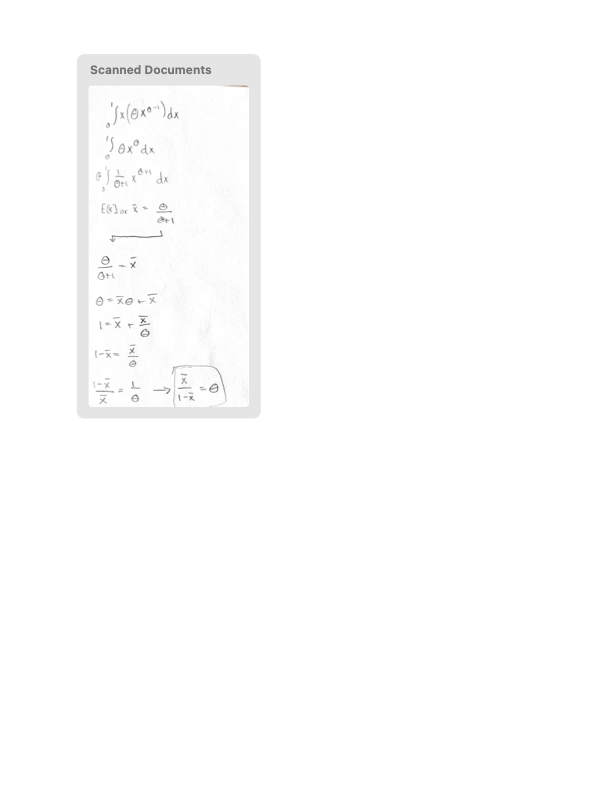

## Problem 1

_Use R to answer the following questions._

In a certain large city, 34% of the adult population has a college degree. In a random sample of size  800,

a. What is the exact probability that between 250 and 290 adults have a college degree?

Hint: ( _Exact distribution:_ B(800,.34).) 

```{r}
pbinom(290,800,.34)-pbinom(250,800,.34)
```

b. What is the approximate normal distribution of the fraction of adults in the sample with a college degree?
_The fraction is a sample mean. What does the Central Limit Theorem say?_ (Answer (i)-(iii) by hand)

* _for each person in the sample the question "Do you have a college degree?" is like a Bernoulli r.v., B(1,p)._

(i). _What is p?_ 

This is already given. p is 0.34

(ii). _what are the mean and standard deviation of a single result?_ 

.34

sqrt(.34*(1-.34)) = 0.4737

(iii). What is the distribution of the sample fraction, that is sample mean?

sqrt((.34*(1.-.34))/800) = 0.0167

Distribution: norm(0.34, 0.0167)

(iv). What is the probability, if the approximate normal distribution is used? (use R). Compare their result with the exact value.

```{r}
pnorm(q=290,mean=.34*800,sd=sqrt(.34*800*(1-.34)))-pnorm(q=250,mean=.34*800,sd=sqrt(.34*800*(1-.34)))
```

The result is almost the same as the first problem.

* The sample fraction has an approximate normal distribution with mean $p$ and standard deviation $\sqrt{\frac{p(1-p)}{n}}$.

* The sample count (number of adults with college degree in the sample) has an approximate normal distribution with mean $np$ and standard deviation $\sqrt{np(1-p)}$. 


# Problem 2

Repeat the Same likelihood example (Example 1) done for Poisson distribution in class for an exponential distribution.

a. Write a function to get the likelihood function for data from exponential distribution.

```{r}
mylikeli.exp = function(lambda,x){
   (lambda^length(x))*(exp(1)^(-lambda*(sum(x))))}
```

b. Generate a random sample of size 5 from an exponential distribution: Let's say the variable named "X.2".

```{r}
X.2 <- rexp(5)
```

c. Compute the likelihoods(using X.2) for a range of lambda(t) and plot them: Then find for which value the likelihood is maximized?

```{r}
t = seq(.01,8,by = .01) #range of lambda

y.1 <- sapply(t,function(t){mylikeli.exp(t,X.2)})

plot(t,y.1, xlab = 'lambda', ylab = 'likelihood',
        type = 'l', lwd = 2)
grid(col = 4)

t[which.max(y.1)]
```

d. Plot the same thing for log likelihood: 

```{r}
t = seq(.01,8,by = .01) #range of lambda

y.1 <- sapply(t,function(t){log(mylikeli.exp(t,X.2))})

plot(t,y.1, xlab = 'lambda', ylab = 'log likelihood',
        type = 'l', lwd = 2)
grid(col = 4)

t[which.max(y.1)]
```

e. Repeat this 10 times

* 10 random samples with the same lambda
* plot each log-likelihood in the same plot
* what can you say about log likelihoods according to the plot?  Does it have to do with the sample size we chose?

```{r}
mysize = c(5, 10, 20, 40, 80, 30, 50, 60, 70, 90)
likeli.1 <- matrix(NA, nrow = length(mysize), ncol = length(t))
for (j in 1:length(mysize)){
   mysample <- rexp(mysize[j])
   likeli.1[j,]  <- sapply(t,function(t){mylikeli.exp(t,mysample)})
}

plot(t,log(likeli.1[1,]), xlab = 'lambda', ylab = 'log-likelihood',
        type = 'l', lwd = 2, col = 1, ylim = c(-300,0))
for (j in 2:length(mysize)){
  lines(t,log(likeli.1[j,]), lwd = 2, col = j)
}
```

The parameter estimation is dependent on the observed values. Depending on the observations, I can estimate different MLE for lambda. With the given observations, I can make a good prediction on my parameters.

# Problem 3

Consider the probability distribution with density
$$
f(x|\theta) = \begin{cases}
\theta x^{\theta - 1} \quad (0 \le x \le 1) \\
0 \quad \text{otherwise}
\end{cases}
$$
where $\theta > 0$ is unknown. 

Find a formula for the method-of-moments estimate for $\theta$.



## Problem 4 (Bonus 5 points)

Exercise 6.4 \#29 in Chihara/Hesterberg. _Note that these are essentially exponential distributions. There are three relative efficiencies to determine._
  
 
$$
var[\hat\theta_1] = \theta^2 \\
var[\hat\theta_2] = (1/4)(2\theta^2) = (1/2)\theta^2 \\
var[\hat\theta_3] = (1/9)(\theta^2+2^2\theta^2) = (5/9)\theta^2
$$

Theta subscript 2 is the most efficient.

(sources: used the book chapter and answer key for guidance)
