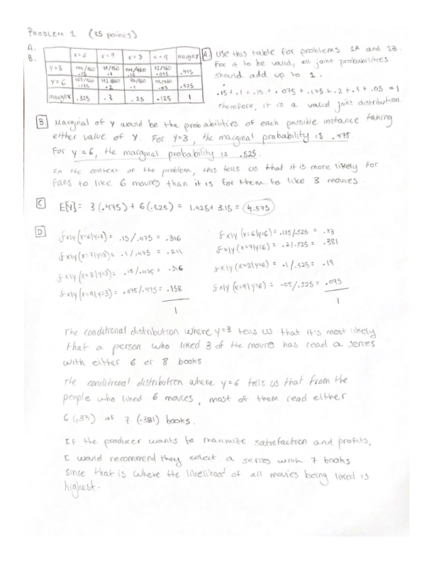
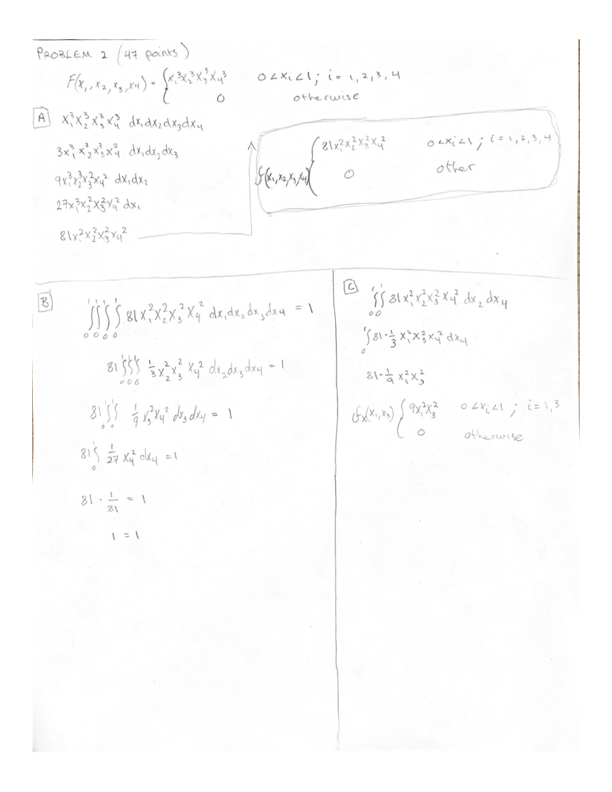
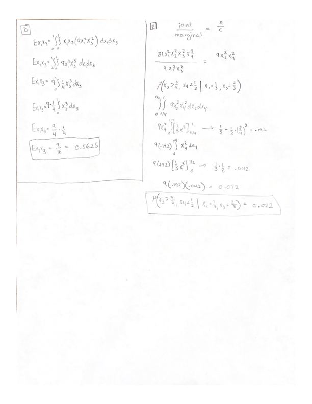
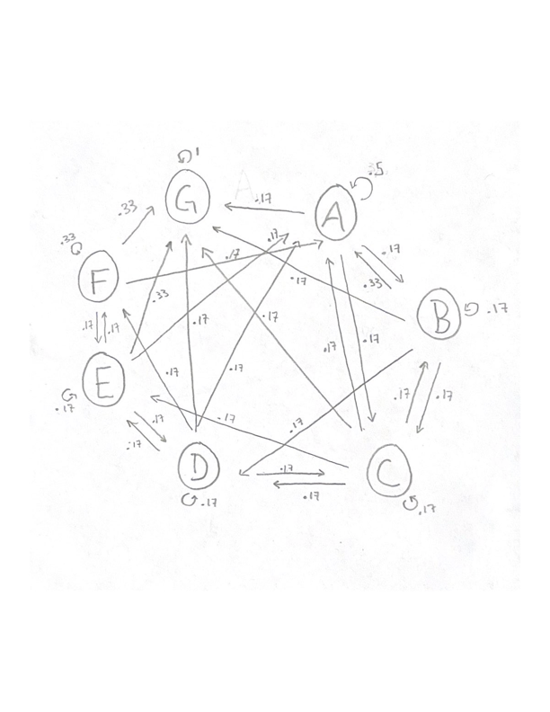

```{r setup, include=FALSE}
knitr::opts_chunk$set(echo = TRUE)
```

# Quiz 4

## Problem 1
Here is an image of the first problem.



## Problem 2
These are the answers to the first three parts of problem 2.



These are the answers to the last 2 parts of problem 2.



## Problem 3

**a.** (10 points) Describe your game and describe how it is a Markov process. (Hint: Remember the game rules will help you to make sure it is a Markov process)

We are playing on a one-dimensional, horizontal board with 7 tiles that are lettered A trough G in alphabetical order. The goal is to reach letter G. In order to advance through the board, we must throw a six-sided die. The die roll will ask you to move in the following manner:

- 1: Move forward one letter
- 2: Move backward one letter
- 3: Move forward two letters
- 4: Move back to A
- 5: Don't move
- 6: Go straight to G

You cannot go further back than A. That is, if you roll a 2 while at A, you will remain at A. In order to land at G from F, you have to roll a 6 or a 1, you can't land on G by rolling a 3 (unless you're at E). Once you get to G, the game is over, so the probability of leaving G is 0.

This game is a Markov Chain because each roll of the die is an independent roll. The probability of entering another stage is not influenced by which stage you're in or which number you got in the previous roll.

**b.** (10 points) Draw the transition diagram.



**c.** (10 points) Construct the transition probability matrix.
```{r}
probs <- c(1/2,  1/3, 1/6, 1/6, 1/6, 1/6, 0,
            1/6, 1/6, 1/6, 0,   0,   0,   0,
            1/6, 1/6, 1/6, 1/6, 0,   0,   0,
            0,   1/6, 1/6, 1/6, 1/6, 0,   0,
            0,   0,   1/6, 1/6, 1/6, 1/6, 0,
            0,   0,   0,   1/6, 1/6, 1/3, 0,
            1/6, 1/6, 1/6, 1/6, 1/3, 1/3, 1)
M <- matrix(probs,nrow=7)
M
```

**d.** (7 points) What is the probability that if the player is currently in state 𝑖 (you can define state 𝑖) then they would win in 12 steps. (Define where/what state the player need to be when/if they win)

```{r}
print(paste0('Beginning from letter A, the probability of getting to letter G in 12 steps is: ', (M%*%M%*%M%*%M%*%M%*%M%*%M%*%M%*%M%*%M%*%M%*%M)[1,7]))
```

**e.** (6 points: 2 points each) Write 3 real life examples where we use the Markov process (except Google page rank) and write 1-2 sentences explaining it. It is okay to use Google to find it but please include reference links for each example.

1. Weather prediction: if we want to predict whether it’ll be sunny or rainy in summer, we can use the Markov chain. The two states are sun or rain and we look at past observations to find the likelihood that a sunny day follows a sunny and that a rainy day follows a rainy day (probability of changing state is 1-probability of staying in the same state). 

2. Market trends: as Dr. Gamage mentioned in class, we can predict market sentiment with Markov chains. We can look at weekly historical data (or daily, monthly, etc.) to see if the market will enter one of the three possible states (i.e., bull, bear, neutral). I think it would be safe to assume that a bull week will most likely follow a bull week, and we can find the likelihood of each state remaining in one state or switching to another.

3. Next word prediction: as mentioned in one of the 511 lab case studies, Markov chains can be used to predict the next word of a sentence. For example, if we have the sentences “I like cats”, “I like dogs”, and “I hate snakes”, the model would dictate that the first word has a 100% probability of being “I”. Then the possible states following “I” would be “like” (0.67 probability) and “hate” (0.33 probability). Finally, there would be three possible states coming after the second word, which would be “dogs”, “cats”, and “snakes”, and each one would be predicted to occur with a probability of 0.33.


