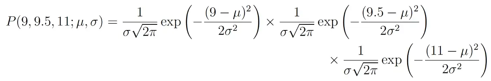
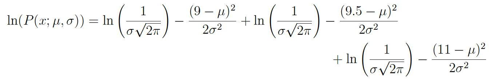
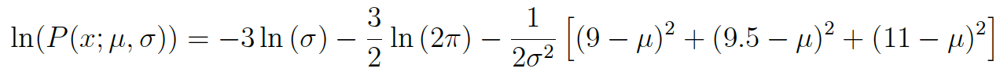

## INSTRUCTIONS:

Any potential violation of Georgetown’s policy on academic integrity will be reported. All work on this exam must be your own. You are not allowed to communicate or gain information in any way from your classmates or seek outside human help on the exam. If you are using online resources always cite the sources (and/or include the links).

You need to SHOW YOUR WORK in order to get full credits.
__________________________________________________________________________


## Problem 1

Watch this video on Mixtape Medley with Ariana Grande and Kelly Clarkson in Jimmy Fallon's Show.
<https://youtu.be/zJUXTrKRdf4>

Again, I have used the spotify API to get data on these 2 artistis. Read More: <https://developer.spotify.com/discover/> 
You can find the descriptions of these variables online (for example : <https://rpubs.com/thieem/685192>)

### Spotify Audio Features

For every track on their platform, Spotify provides data for thirteen Audio Features.The Spotify Web API developer guide<https://developer.spotify.com/discover/>  defines them as follows:

`Danceability`: Describes how suitable a track is for dancing based on a combination of musical elements including tempo, rhythm stability, beat strength, and overall regularity. 

`Valence`: Describes the musical positiveness conveyed by a track. Tracks with high valence sound more positive (e.g. happy, cheerful, euphoric), while tracks with low valence sound more negative (e.g. sad, depressed, angry).

`Energy`: Represents a perceptual measure of intensity and activity. Typically, energetic tracks feel fast, loud, and noisy. For example, death metal has high energy, while a Bach prelude scores low on the scale.

`Tempo`: The overall estimated tempo of a track in beats per minute (BPM). In musical terminology, tempo is the speed or pace of a given piece, and derives directly from the average beat duration.

`Loudness`: The overall loudness of a track in decibels (dB). Loudness values are averaged across the entire track and are useful for comparing relative loudness of tracks.

`speechiness`: This detects the presence of spoken words in a track. The more exclusively instrum-like the recording (e.g. talk show, audio book, poetry), the closer to 1.0 the attribute value.

`Instrumentalness`: Predicts whether a track contains no vocals. “Ooh” and “aah” sounds are treated as instrumental in this context. Rap or spoken word tracks are clearly “vocal”.

`Liveness`: Detects the presence of an audience in the recording. Higher liveness values represent an increased probability that the track was performed live.

`Acousticness`: A confidence measure from 0.0 to 1.0 of whether the track is acoustic.

`Key`: The estimated overall key of the track. Integers map to pitches using standard Pitch Class notation . E.g. 0 = C, 1 = C♯/D♭, 2 = D, and so on.

`Mode`: Indicates the modality (major or minor) of a track, the type of scale from which its melodic content is derived. Major is represented by 1 and minor is 0.

`Duration`: The duration of the track in milliseconds.

`Time Signature`: An estimated overall time signature of a track. The time signature (meter) is a notational convention to specify how many beats are in each bar (or measure).


### You can find the 2 data sets: "Kelly_Clarkson.csv", "Arianna_grande.csv" inside the folder.

```{r}
# import the datasets
kc <- read.csv('./Kelly_Clarkson.csv')
ag <- read.csv('./Arianna_grande.csv')
```

**a.** After watching that video and your previous knowledge about these 2 artists, Create a Data Science question on something you'd like to compare and investigate about these two artists. Please make the data science question to compare the `averages` OR `proportions` (2 sample) of attributes for these two artists.

I'm interested in finding out if Ariana Grande's music has a higher denceability score than Kelly Clarkson's. So the question would be: is Ariana Grande's average danceability score greater than Kelly Clarkson's?

(Please don't use the variables that you used in Lab 10 or Homework 5. That is, don't use the variables "instrumentalness","liveness" or "valence".)

**b.** Do Exploratory Data Analysis (EDA) using Data Visualizations regarding your above Data Science Question.

```{r}
boxplot(kc$kc.danceability,ag$ag.danceability, names=c('Kelly Clarkson','Ariana Grande'), ylab='Danceability', xlab='Artist', main='Distribution of Danceability per Artist')
```

Based on the boxplots, my initial impression is that Ariana Grande's mean danceability score is higher than Kelly Clarkson's. However, we know that visualizations can at times be misleading, so we need statistical evidence of this being true. Ariana Grande has a couple of outliers at the bottom of the plot, which could stem from romance songs that have a slower beat and flow than her usual pop music. Kelly Clarkson also has some outliers, but not as many as Arianna.

`Perform a Hypothesis test to answer the above data science question.`

**c.** Write your Null and Alternative Hypothesis.

Null: The mean danceability score for Kelly Clarkson and Arianna Grande is equal.

Alternative: The mean danceability scores for Arianna Grande and Kelly Clarkson are not equal.

**d.** Do a t-test (if your Data science question is about population _averages_. If your question is about comparing _proportions_ then use a Z-test), and write your conclusion at 5\% significance level.

```{r}
# grabbing the danceability columns
ag.d <- ag$ag.danceability
kc.d <- kc$kc.danceability

# perform the t-test
t.test(ag.d, kc.d, alt='greater')
```

Using 0.05 p-value as our significance threshold, we have enough evidence to reject the null hypothesis of both danceability means being equal. For this sample, the average danceability score for Ariana is ~14% higher than Kelly's.

**e.** Do a bootstrap test (here you will be using bootstrap sampling and 95% bootstrap percentile interval) to answer the same question and write your conclusion at 5\% significance level.

```{r}
set.seed(42)

# bootstrapping
boot.ag <- replicate(1000, mean(sample(ag.d, length(ag.d), replace=TRUE)))
boot.kc <-replicate(1000, mean(sample(kc.d, length(kc.d), replace=TRUE)))

# find the ratio of means
boot.ratio <- boot.ag/boot.kc

# get the mean and sd of the ratio vector
ratio.mean <- mean(boot.ratio)
ratio.sd <- sd(boot.ratio)

# get the confidence intervals
rci <- ratio.mean + 2*ratio.sd
lci <- ratio.mean - 2*ratio.sd

# print the result
paste0('We are 95% confident that the ratio of danceability means between Ariana Grande and Kelly Clarkson is between ', lci, ' and ', rci)

# t test
t.test(boot.ag, boot.kc)
```

Since we are 95% confident that the ratio of means between Grande and Clarkson is between 1.1 and 1.17, and the p-value is 0.001, we have enough evidence to reject the null hypothesis of both danceability means being equal. A ratio higher or lower than 1, by a significant amount, shows that the means aren't equal. The T-test also confirms that the means are different.

**f.** Compare your results from part d and e.

Part D strongly rejects the null hypothesis, as does part e. Both results give me reason to believe that Ariana Grande does in fact have a greater average danceability score than Kelly Clarkson.
  
**g.** Write two broader topics that could be analysed using these millions of data provided by Spotify. (Can get some idea from here : <https://research.atspotify.com/datasets/>)

1. For the million playlist dataset, it seems like they're interested in adding artists/songs to the existing playlists and seeing if the users like the additions. We could analyze the mean of the metrics of different artists and add the music that doesn't reject the null hypothesis (i.e. means of variables being equal) to their respective playlists. My guess is that artists with similar mean metrics would fit into the same playlist and ensure the user enjoys it.

2. Although I didn't find this specific data in the website provided, I think an interesting analysis would be to find the profile of average listeners to certain types of music. If Spotify has data on their users (e.g. age, race, country of origin, salary, etc...), we could find a way to profile types of music based on their listeners average scores. Doing this, we could create clusters of music with labels such as 'universally liked', 'niche', etc.

## Problem 2 : Federal Bureau of Investigation (FBI), Crime Data Explorer

The Crime Data Explorer (CDE) <https://crime-data-explorer.fr.cloud.gov/pages/downloads> provides select data sets for download. Incident-based data by state, summary data estimates, and data about other specific topics may be downloaded in CSV files from the selections in this site. Data are also available via the Crime Data API, a read-only web service that returns JSON or CSV data, and provides experienced users access to large amounts of UCR data to use and share.

(There are many data sets that you can download from this site if you'd like to use them for your final projects)

I have selected a data set from Hate Crime Statistics Annual Reports, that has information on crime (different offense types) and offender's race and ethnicity.

You are going to do a hypothesis testing to answer the 

##### Question: whether there is a relationship between offense type and known offender's Ethnicity. (Hint: whether they are independent?)

I'm giving you the original dataset. You need to extract necessary data from that data set to answer the above question. For `Offense Type` use the main 3 categories `Crimes against persons` , `Crimes against property` and `Crimes against society`.

```{r}
library(readxl)
library(janitor)
library(dplyr)
library(tibble)
crimes <- read_excel('./Table_3_Offenses_Known_Offenders_Race_and_Ethnicity_by_Offense_Type_2020.xlsx', sheet=2)
crimes <- data.frame(crimes)
rownames(crimes) <- crimes$Crime
crimes <- subset(crimes, select = -c(Crime))
crimes
t.crimes <- data.frame(t(crimes))
t.crimes
```

**a.** In order to answer this question on independence, what Hypothesis test will you be using?

Since we're trying to understand if the variables are independent of each other, we would have to use a chi squared test.

**b.** Do EDA relevant to this question. What can you observe from your Data Visualizations?

```{r}
barplot(as.matrix(t.crimes), col=c('light blue','pink','purple','light yellow'), legend.text=rownames(t.crimes), main='Count per Crime Type Colored by Ethnicity')
```

It seems like most crimes are being committed by either of the following groups: UnknownEthnicity or NotHispanicOrLatino. Realistically, this ratio is not representative of the truth, as it could be misrepresenting in any direction. For there to be no relation, we should have equal distribution of crimes across all ethnic groups, which we don't. I also don't like that ethnicity options are only hispanic or not hispanic. We should have more types of ethnicities to fully understand the relations between them. 

**c.** What is the Null and Alternative Hypothesis?

Null: Crime type does not depend on ethnicity of the criminal. That is, the ethnicity of the offender will have no effect on the crime committed.

Alternative: Crime type and ethnicity are dependent variables. That is, ethnicity plays a role in the type of crime committed.

**d.** From your test, what is the conclusion at 5\% significance level?

```{r}
chisq.test(crimes)
```

Given that the p-value is less than 0.05, we have enough evidence to reject the null hypothesis of crime type and ethnicity being independent of each other.

**e.** As an impartial data scientist, what can you say about what you have observed above from the statistical test?

We have sufficient evidence to believe that a criminal's ethnicity affects the type of crime committed. It would appear that certain ethnic groups are more prone to commit certain crimes. Looking at the data we have available, this conclusion makes sense, as most crimes came from the same two group (Hispanic, Not hispanic).

## Problem 3

**a.** Explain 1 example where Maximum Likelihood Estimation is used for estimating the parameters of statistical models; _models used in ML_. Please use your own words for explanation.

You can refer to any articles/papers/online examples. If you are using online examples, don't forget to refer the link here and explain how the MLE procedure is being used and explain the steps of MLE calculation. 

(You don't have to go into great details, but explain these examples assuming that you are a TA for 511 in the Fall 2023  and you are explaining this to a new student)

Used this article to understand the problem:

https://towardsdatascience.com/probability-concepts-explained-maximum-likelihood-estimation-c7b4342fdbb1

https://machinelearningmastery.com/linear-regression-with-maximum-likelihood-estimation/

Linear regression is a model that uses maximum likelihood estimate to find its parameters. Following is an example of simple linear regression and how to calculate parameters with MLE.

Before talking about MLE, we should first mention model parameters. A simple example to understand this topic would be with a simple, one-variable linear regression model in which we're trying to predict a house price based on the squared feet of the construction. This model could be represented by *y = mx + c*. The parameters for this model are *m* and *c*. Changing the values of m and c would change the y-intercept and slope of the linear model. That is, *m* describes the magnitude at which a change in square feet would change the house's price; *c* is a constant we add to the model to minimize error. Ideally, we want to find the model parameters that optimize our predictions. But how can we do this?

MLE can be used to solve this task. MLE would find the values of the parameter such that it maximizes the likelihood that your model produces the data observed.

To calculate the MLE parameters, we need to make the assumption that data points are independently generated from each other. First, we must take the joint probability density function of the data (this would give us some variables within the function that we don't know). 



We need to find the values of mu and sigma that maximize this expression, and this can be done by differentiating. But, to simplify the math, we can take the log of the likelihood function, which looks like this (original and simplified):





Once simplified, you differentiate the function with respect to the parameter you want to find (in this example mu):


And if you set the left hand side equal to 0 and rearrange for mu we get:


You could repeat the process for sigma, but you get the point. Doing this type of calculation would give you the mu and sigma values for a function that is most likely to properly represent the observed data. This helps us find the best parameters for a linear regression model (and others).

**b.** Write another model/place where Maximum Likelihood Estimation is used for estimating the parameters (again a model used in ML) but you don't have to explain the steps.

https://www.mygreatlearning.com/blog/maximum-likelihood-estimation/

Logistic regression uses MLE.

## Problem 4 (Bonus-10 points)

(Self-learn Question: MANOVA)

(It is okay to use the internet to find answers but please put links to all your references and try to write the answers on your words as much as possible)

**a.** In a few sentences, in your words, explain where/when/in what situations MANOVA is being used. What assumptions are used in this test?

Used these pages for my understanding on MANOVA: 
https://uk.sagepub.com/sites/default/files/upm-assets/9761_book_item_9761.pdf
https://www.geeksforgeeks.org/manova-test-in-r-programming/
http://www.sthda.com/english/wiki/manova-test-in-r-multivariate-analysis-of-variance

MANOVA:

This test tries to find if two or more variables are dependent on a controlled variable. It can be used for testing if a label/category value would explain the variance in other, dependent, continuous variables. An example would be: we are giving two different treatments to two groups of rats and we record how each treatment affects both their height and weight. We are interested in finding out if the treatments differently affect both height and weight (hypothesis: both weight and height together are affected differently by each treatment). A MANOVA test would be good to test this hypothesis.

MANOVA assumptions:

1. The dependent variables are normally distributed.
2. There is homogeneity of variances across the range of predictors.
3. There is linearity between all pairs of covariates, dependent variables, and all dependent variable-covariate pairs in every cell.

**b.** Demonstrate one example where you would use this test in R. Write your conclusions.

I used the following links to find an example of using MANOVA in R and to understand how to replicate it.

http://www.sthda.com/english/wiki/manova-test-in-r-multivariate-analysis-of-variance

https://www.geeksforgeeks.org/manova-test-in-r-programming/

```{r}
# load the data
data("iris")
head(iris)

# doing the MANOVA test
r.manova <- manova(cbind(Sepal.Length, Petal.Length) ~ Species, data = iris)
summary(r.manova)
summary.aov(r.manova)
```

Conclusion: Based on the summary from the test, we have enough evidence to reject the null hypothesis. Therefore, Sepal Length and Petal Length are significantly different for each Species, rather than them having the same values for each species.
